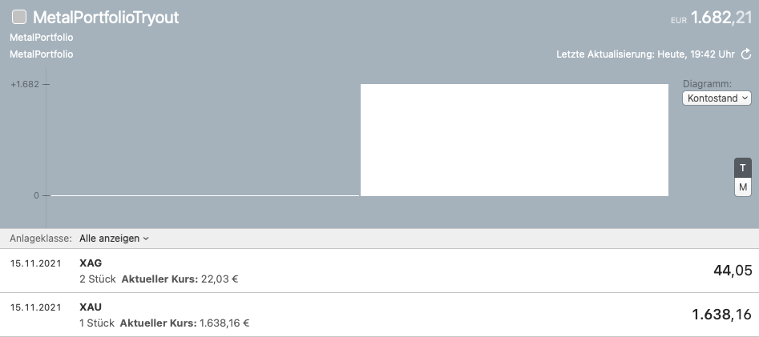
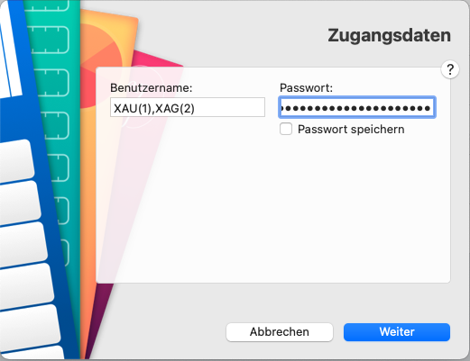

# MetalPortfolio for MoneyMoney
Create a custom portfolio with metals (e.g. gold or silver) and fetch the current value via goldapi.io

## Setup

1. Download the extension [MetalPortfolio.lua](MetalPortfolio.lua)
2. Once downloaded, move `MetalPortfolio.lua` to your MoneyMoney Extensions folder.
3. Create a free [goldapi.io](https://www.goldapi.io/) account and copy the API-key from [https://www.goldapi.io/dashboard](https://www.goldapi.io/dashboard)
4. Add a new account with the type `MetalPortfolio`
5. Use the Metal symbols from the goldapi page comma seperated with the number of units in brackets as user name. Example: `XAU(1),XAG(2)`
6. Use the API key as password. Example: `goldap-xyasdfasdfasdfasdf-io`

### Adding, editing and removing items
1. Right click on `MetalPortfolio` in sidebar
2. Click `Edit login data...`
3. Edit and save

### Bonus: Display profits
Add the buying rates in MoneyMoney via right click on the stock to display the profits.

### Requirements
You need a beta version of MoneyMoney.
